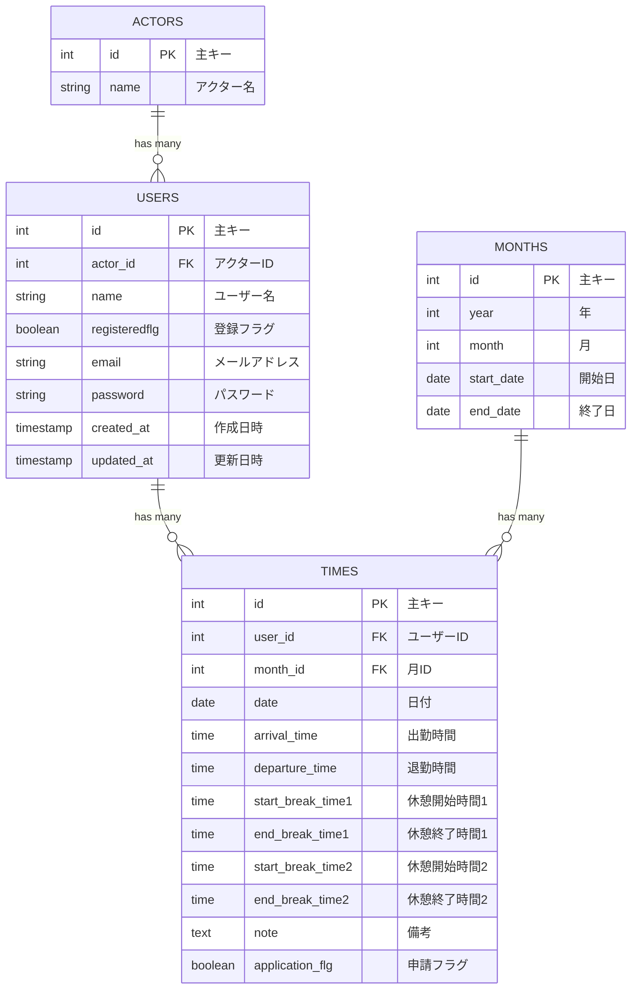

# Timelog - 勤怠管理システム

<p align="center"><a href="https://laravel.com" target="_blank"></a></p>

<p align="center">
<a href="https://travis-ci.org/laravel/framework"></a>
<a href="https://packagist.org/packages/laravel/framework"></a>
<a href="https://packagist.org/packages/laravel/framework"></a>
<a href="https://packagist.org/packages/laravel/framework"></a>
</p>

## プロジェクト概要

Timelog は、Laravel と Docker を使用した勤怠管理システムです。従業員の出退勤時間、休憩時間、勤務申請などを管理できます。

## 技術スタック

-   **フレームワーク**: Laravel 10.x
-   **データベース**: MySQL 8.0.26
-   **Web サーバー**: Nginx 1.21.1
-   **PHP**: 8.1-FPM
-   **コンテナ**: Docker & Docker Compose

## データベース設計

### ER 図



### テーブル詳細

#### Users テーブル

-   **id**: 主キー（自動増分）
-   **actor_id**: アクター ID（外部キー）
-   **name**: ユーザー名
-   **registeredflg**: 登録フラグ（boolean）
-   **email**: メールアドレス
-   **password**: パスワード（ハッシュ化）
-   **created_at**: 作成日時
-   **updated_at**: 更新日時

#### Actors テーブル

-   **id**: 主キー（自動増分）
-   **name**: アクター名

#### Months テーブル

-   **id**: 主キー（自動増分）
-   **year**: 年
-   **month**: 月
-   **start_date**: 開始日
-   **end_date**: 終了日

#### Times テーブル

-   **id**: 主キー（自動増分）
-   **user_id**: ユーザー ID（外部キー）
-   **month_id**: 月 ID（外部キー）
-   **date**: 日付
-   **arrival_time**: 出勤時間
-   **departure_time**: 退勤時間
-   **start_break_time1**: 休憩開始時間 1
-   **end_break_time1**: 休憩終了時間 1
-   **start_break_time2**: 休憩開始時間 2
-   **end_break_time2**: 休憩終了時間 2
-   **note**: 備考
-   **application_flg**: 申請フラグ（boolean）

## セットアップ

### 前提条件

-   Docker
-   Docker Compose

### インストール手順

1. リポジトリをクローン

```bash
git clone https://github.com/yusuke-yano-01/Timelog.git
cd Timelog
```

2. Docker サービスを起動

```bash
docker-compose up -d
```

3. PHP コンテナにアクセス

```bash
docker-compose exec php bash
```

4. 依存関係をインストール

```bash
composer install
```

5. 環境設定ファイルをコピー

```bash
cp .env.example .env
```

6. アプリケーションキーを生成

```bash
php artisan key:generate
```

7. データベースマイグレーション実行

```bash
php artisan migrate
```

### アクセス URL

-   **アプリケーション**: http://localhost
-   **phpMyAdmin**: http://localhost:8080

## About Laravel

Laravel is a web application framework with expressive, elegant syntax. We believe development must be an enjoyable and creative experience to be truly fulfilling. Laravel takes the pain out of development by easing common tasks used in many web projects, such as:

-   [Simple, fast routing engine](https://laravel.com/docs/routing).
-   [Powerful dependency injection container](https://laravel.com/docs/container).
-   Multiple back-ends for [session](https://laravel.com/docs/session) and [cache](https://laravel.com/docs/cache) storage.
-   Expressive, intuitive [database ORM](https://laravel.com/docs/eloquent).
-   Database agnostic [schema migrations](https://laravel.com/docs/migrations).
-   [Robust background job processing](https://laravel.com/docs/queues).
-   [Real-time event broadcasting](https://laravel.com/docs/broadcasting).

Laravel is accessible, powerful, and provides tools required for large, robust applications.

## Learning Laravel

Laravel has the most extensive and thorough [documentation](https://laravel.com/docs) and video tutorial library of all modern web application frameworks, making it a breeze to get started with the framework.

If you don't feel like reading, [Laracasts](https://laracasts.com) can help. Laracasts contains over 1500 video tutorials on a range of topics including Laravel, modern PHP, unit testing, and JavaScript. Boost your skills by digging into our comprehensive video library.

## Laravel Sponsors

We would like to extend our thanks to the following sponsors for funding Laravel development. If you are interested in becoming a sponsor, please visit the Laravel [Patreon page](https://patreon.com/taylorotwell).

### Premium Partners

-   **[Vehikl](https://vehikl.com/)**
-   **[Tighten Co.](https://tighten.co)**
-   **[Kirschbaum Development Group](https://kirschbaumdevelopment.com)**
-   **[64 Robots](https://64robots.com)**
-   **[Cubet Techno Labs](https://cubettech.com)**
-   **[Cyber-Duck](https://cyber-duck.co.uk)**
-   **[Many](https://www.many.co.uk)**
-   **[Webdock, Fast VPS Hosting](https://www.webdock.io/en)**
-   **[DevSquad](https://devsquad.com)**
-   **[Curotec](https://www.curotec.com/services/technologies/laravel/)**
-   **[OP.GG](https://op.gg)**
-   **[WebReinvent](https://webreinvent.com/?utm_source=laravel&utm_medium=github&utm_campaign=patreon-sponsors)**
-   **[Lendio](https://lendio.com)**

## Contributing

Thank you for considering contributing to the Laravel framework! The contribution guide can be found in the [Laravel documentation](https://laravel.com/docs/contributions).

## Code of Conduct

In order to ensure that the Laravel community is welcoming to all, please review and abide by the [Code of Conduct](https://laravel.com/docs/contributions#code-of-conduct).

## Security Vulnerabilities

If you discover a security vulnerability within Laravel, please send an e-mail to Taylor Otwell via [taylor@laravel.com](mailto:taylor@laravel.com). All security vulnerabilities will be promptly addressed.

## License

The Laravel framework is open-sourced software licensed under the [MIT license](https://opensource.org/licenses/MIT).
